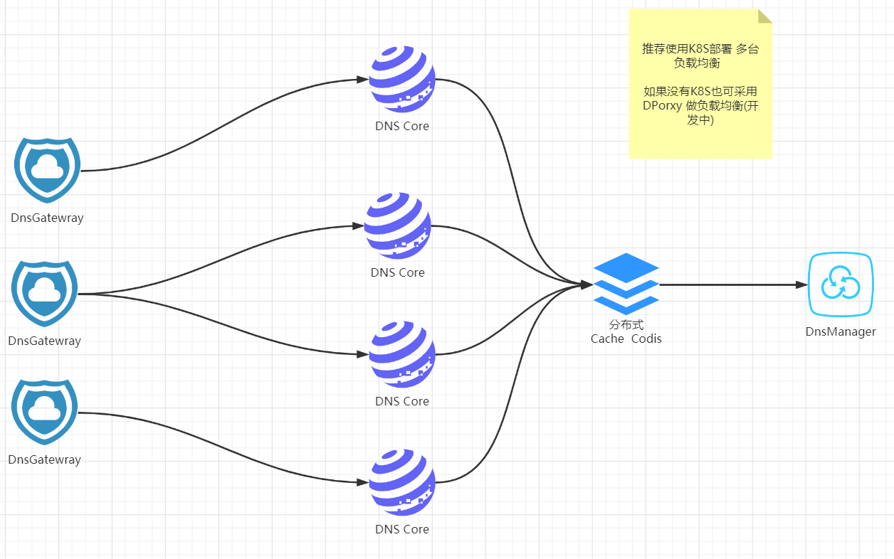

# smart-dns-go
smart-dns-go  go version SmartDns 后端


Smart DNS 不仅为域名解析系统 也可充当公共DNS服务器

### 编译 傻逼GO1.5 
``` 
export GODEBUG=x509ignoreCN=0
```

### Deployment
``` 
docker pull redis:6.0.5-alpine
docker run -d  --name my_redis --restart=always -p 6379:6379 redis:6.0.5-alpine

docker pull postgres:13.0-alpine
docker run -d  --name my_pgsql --restart=always -p 5432:5432 -e POSTGRES_PASSWORD=root postgres:13.0-alpine
```
